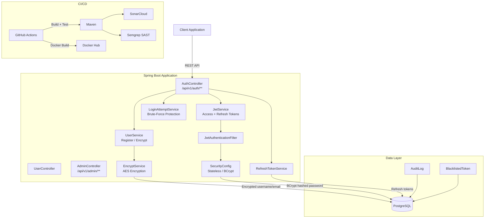

# RGPD Auth Backend

> GDPR-compliant authentication REST API built with Spring Boot, featuring encrypted PII storage, JWT access/refresh tokens, brute-force protection, and a full CI/CD pipeline with SonarCloud and Docker.


## Architecture



## Features

- **RGPD-compliant PII storage**: usernames and emails are AES-encrypted at rest
- **Password security**: BCrypt hashing with custom `@StrongPassword` validator (12+ chars)
- **JWT authentication**: short-lived access tokens + long-lived refresh tokens stored in DB
- **Brute-force protection**: account lockout after repeated failed login attempts
- **Role-based access control**: USER and ADMIN roles with endpoint-level authorization
- **Token lifecycle**: refresh, revoke (logout), and automatic cleanup via scheduled jobs
- **Audit logging**: tracks security-relevant events
- **CI/CD pipeline**: GitHub Actions with Maven build, SonarCloud analysis, Semgrep SAST, and Docker push
- **Non-root Docker image**: Eclipse Temurin 17 Alpine with dedicated user

## Tech Stack

| Category | Technology |
|----------|-----------|
| Language | Java 17 |
| Framework | Spring Boot 3.1.5 |
| Security | Spring Security, JWT (jjwt 0.12.5), BCrypt |
| Database | PostgreSQL |
| ORM | Spring Data JPA / Hibernate |
| Encryption | AES (configurable algorithm) |
| CI/CD | GitHub Actions |
| Code Quality | SonarCloud, Semgrep |
| Container | Docker (Eclipse Temurin 17 Alpine) |
| Validation | Jakarta Bean Validation |

## Getting Started

### Prerequisites

- Java 17+
- Maven 3.8+
- PostgreSQL 14+
- Docker (optional)

### Installation

```bash
git clone https://github.com/g-holali-david/rgpd-auth-backend.git
cd rgpd-auth-backend

# Configure environment variables (create a .env file)
# DB_HOST, DB_PORT, DB_NAME, DB_USER, DB_PASS
# JWT_SECRET, JWT_ACCESS_EXPIRATION_MS, JWT_REFRESH_EXPIRATION_MS
# ENC_ALGORITHM, ENC_SECRET_KEY

# Build and run
./mvnw clean package
java -jar target/backend-0.0.1-SNAPSHOT.jar
```

### Usage

```bash
# Register a new user
curl -X POST http://localhost:8080/api/v1/auth/register \
  -H "Content-Type: application/json" \
  -d '{"username":"john","email":"john@example.com","password":"MyStr0ngP@ss!!"}'

# Login
curl -X POST http://localhost:8080/api/v1/auth/login \
  -H "Content-Type: application/json" \
  -d '{"username":"john","password":"MyStr0ngP@ss!!"}'

# Refresh token
curl -X POST http://localhost:8080/api/v1/auth/refresh \
  -H "Content-Type: application/json" \
  -d '{"refreshToken":"<token>"}'

# Docker
docker build -t rgpd-auth-backend .
docker run -p 8080:8080 --env-file .env rgpd-auth-backend
```

## Project Structure

```
rgpd-auth-backend/
├── Dockerfile
├── pom.xml
├── sonar-project.properties
├── .github/workflows/ci.yml       # CI/CD: build, test, SonarCloud, Semgrep, Docker
└── src/main/java/ms/secureprofile/backend/
    ├── BackendApplication.java
    ├── controller/
    │   ├── AuthController.java     # Register, Login, Refresh, Logout
    │   ├── UserController.java     # User profile operations
    │   └── AdminController.java    # Admin-only endpoints
    ├── model/
    │   ├── User.java               # Encrypted username/email, hashed password
    │   ├── Role.java               # USER, ADMIN
    │   ├── RefreshToken.java
    │   ├── AuditLog.java
    │   └── BlacklistedToken.java
    ├── security/
    │   ├── SecurityConfig.java     # Stateless JWT, CORS, BCrypt
    │   ├── JwtService.java         # Token generation & validation
    │   ├── JwtAuthenticationFilter.java
    │   ├── EncryptService.java     # AES encryption for PII
    │   ├── LoginAttemptService.java # Brute-force lockout
    │   └── UserDetailsServiceImpl.java
    ├── service/
    │   ├── UserService.java
    │   ├── AuditService.java
    │   └── RefreshTokenService.java
    ├── repository/                 # JPA repositories
    ├── validation/
    │   ├── StrongPassword.java     # Custom annotation
    │   └── StrongPasswordValidator.java
    └── exception/
        └── ValidationExceptionHandler.java
```

## API Endpoints

| Method | Endpoint | Description | Auth |
|--------|----------|-------------|------|
| POST | `/api/v1/auth/register` | Register new user | Public |
| POST | `/api/v1/auth/login` | Authenticate & get tokens | Public |
| POST | `/api/v1/auth/refresh` | Refresh access token | Public |
| POST | `/api/v1/auth/logout` | Revoke refresh tokens | Public |
| GET | `/api/v1/admin/**` | Admin operations | ADMIN role |

## Author

**Holali David GAVI** — Cloud & DevOps Engineer
- Portfolio: [gholalidavid.com](https://gholalidavid.com)
- GitHub: [@g-holali-david](https://github.com/g-holali-david)
- LinkedIn: [Holali David GAVI](https://www.linkedin.com/in/holali-david-g-4a434631a/)

## License

MIT
